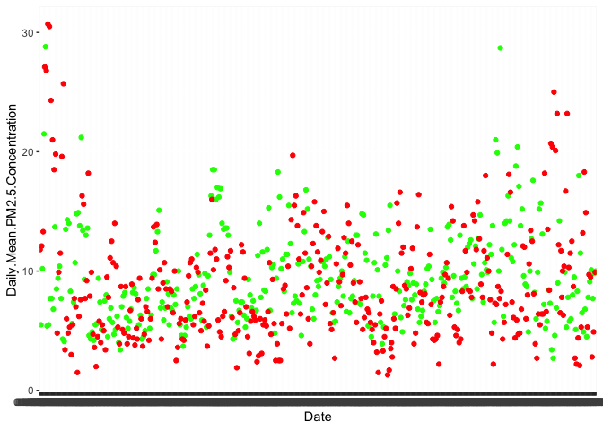
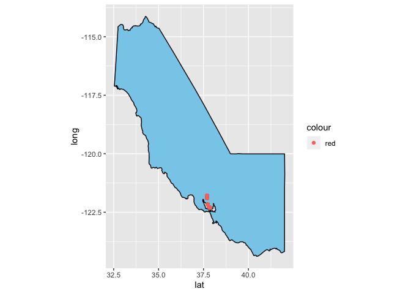

### Introduction

With the looming threat of climate change and the increasing focus on
the environment, I thought it might be cool to do a few simple tests and
visualizations. Data was obtained from the US Government’s environmental
data, which is freely available.

    # packages and data is read in
    library(dplyr)

    ## 
    ## Attaching package: 'dplyr'

    ## The following objects are masked from 'package:stats':
    ## 
    ##     filter, lag

    ## The following objects are masked from 'package:base':
    ## 
    ##     intersect, setdiff, setequal, union

    library(ggplot2)
    data2019 = read.csv("~/Downloads/berkeleypollutiondata2019.csv")
    data2010 = read.csv("~/Downloads/berkeleypollutiondata2010.csv")
    berkeley2019 = filter(data2019,Site.Name=="Berkeley Aquatic Park")
    berkeley2010 = filter(data2010,Site.Name=="Berkeley")

### Exploration

Let’s compare 2010 and 2019 in terms of air pollution.

    ggplot()+
      geom_point(data=berkeley2019,color="green",aes(x=Date,y=Daily.Mean.PM2.5.Concentration))+
      geom_point(data=berkeley2010,color="red",aes(x=Date,y=Daily.Mean.PM2.5.Concentration))

### Hypothesis test

Did pollution significantly increase in the last 10 years at the
Berkeley pollution detector?

    m1 = mean(berkeley2010$Daily.Mean.PM2.5.Concentration,na.rm=TRUE)
    m2 = mean(berkeley2019$Daily.Mean.PM2.5.Concentration,na.rm=TRUE)
    sd1 = sd(berkeley2010$Daily.Mean.PM2.5.Concentration,na.rm=TRUE)
    sd2 = sd(berkeley2019$Daily.Mean.PM2.5.Concentration,na.rm=TRUE)
    se1 = sd1/sqrt(length(berkeley2010$Daily.Mean.PM2.5.Concentration))
    se2 = sd2/sqrt(length(berkeley2019$Daily.Mean.PM2.5.Concentration))
    setot = sqrt((se1^2)+(se2^2))
    z = (m2-m1)/setot
    print(z)

    ## [1] 1.803585

    p = 1-pnorm(z)
    print(p)

    ## [1] 0.03564819

### Post credits: Playing around with Maps xD

    library(ggmap)

    ## Google's Terms of Service: https://cloud.google.com/maps-platform/terms/.

    ## Please cite ggmap if you use it! See citation("ggmap") for details.

    library(maps)
    library(mapdata)
    us_states = map_data("state")
    usa = map_data("usa")
    america_map = ggplot()+
      geom_polygon(data=usa, aes(x=long,y=lat,group=group),fill="green",color="red")+
      coord_fixed(1.3)

    states_map = ggplot()+
      geom_polygon(data=us_states, aes(x=long,y=lat,group=group,fill=factor(region)),color="red")+
      coord_fixed(1.3)+
      guides(fill=FALSE)

    california = filter(us_states,region=='california')

    site_mean = function(city){
      mean(filter(data2019,Site.Name==city)$DAILY_AQI_VALUE)
    }
    site_mean("Berkeley Aquatic Park")

    ## [1] 37.83523

    site_means_2019 = c(site_mean("Berkeley Aquatic Park"),site_mean("Pleasanton - Owens Ct"),site_mean("Livermore")
                        ,site_mean("Laney College"),site_mean("Oakland"), site_mean("Oakland West"))
    sites = c("Berkeley Aquatic Park","Pleasanton - Owens Ct","Livermore","Laney College","Oakland","Oakland West")

    ggplot()+
      geom_polygon(data=california,aes(x=lat,y=long),fill="skyblue",color="black")+
      geom_point(data=data2019,aes(x=SITE_LATITUDE,y=SITE_LONGITUDE,color="red"))+
      coord_fixed(1.3)+
      guides(fill=FALSE)

