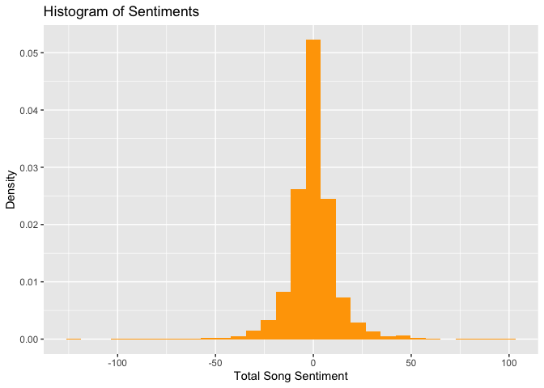
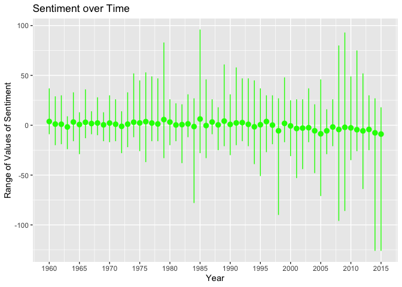
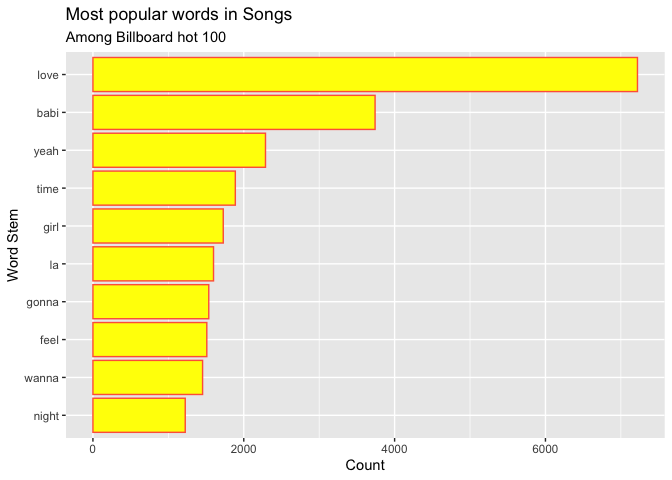
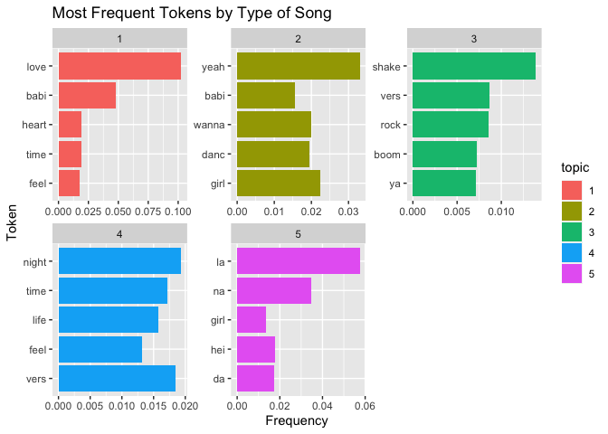
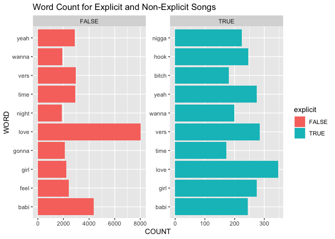
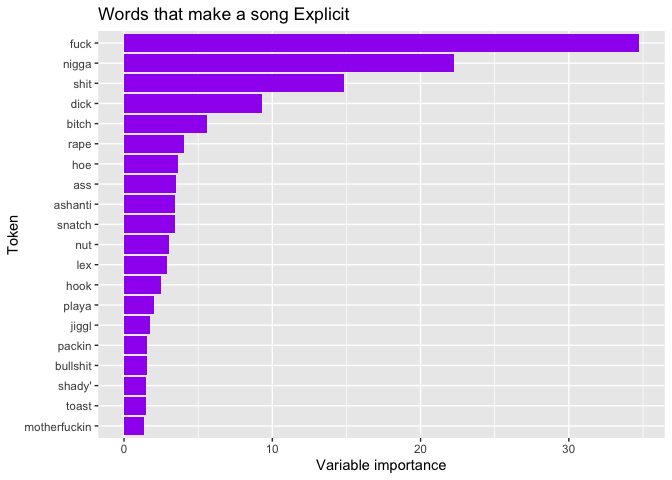

Billboard Baggins
================
Ram Mukund Kripa
8/03/2020

# The Task

This file aims to identify trends in sentiments, and develop models to
classify songs by genres and explicitness on the basis of their lyrics.

# Packages

``` r
library(tidyverse)
library(here)
library(lubridate)
library(tidytext)
library(topicmodels)
library(tm)
library(knitr)
library(billboard)
```

# Obtaining and Wrangling Data

## Getting data: Billboard Lyrics & Spotify

Joining the lyrics and spotify datasets, because each provides useful
information\!

``` r
bilb_dat <- spotify_track_data %>%
  select(year,artist_name,track_name,explicit) %>%
  right_join(lyrics, by = c("artist_name" = "artist", 
                            "track_name" = "title",
                            "year" = "year"
                            )) %>%
  drop_na(lyrics) %>%
  drop_na(explicit)
head(bilb_dat)
```

    ## # A tibble: 6 x 5
    ##   year  artist_name    track_name       explicit lyrics                         
    ##   <chr> <chr>          <chr>            <lgl>    <chr>                          
    ## 1 1960  Johnny Preston Running Bear     FALSE    "On the bank of the river\nSto…
    ## 2 1960  Mark Dinning   Teen Angel       FALSE    "Teen Angel\nTeen Angel\nTeen …
    ## 3 1960  Jimmy Jones    Handy Man        FALSE    "Comma, comma, comma, comma, c…
    ## 4 1960  Elvis Presley  Stuck on You     FALSE    "[Verse 1]\nYou can shake an a…
    ## 5 1960  Connie Francis Everybody's Som… FALSE    "The tears I cried for you cou…
    ## 6 1960  The Brothers … Greenfields      FALSE    "Once there were greenfields\n…

## Tokenizing and Stemming

``` r
billb_tokens <- bilb_dat %>%
  unnest_tokens(output = word, input = lyrics) %>%
  # removing stop words
  anti_join(stop_words) %>%
  # remove chorus 
  filter(word!="chorus") %>%
  # remove numbers 
  filter(!str_detect(word, "^[0-9]*$")) %>%
  # stemming
  mutate(word = SnowballC::wordStem(word))
```

# Part 1: Positive or Negative?

This analysis aims to identify whether songs through the years in the
billboard 100 tend to be positive or negative, and how that has changed
over time. There is a general sentiment among audioheads that songs in
the sixties and eighties were much “happier” than they are today. Let’s
test that theory\!

## What does the sentiment distribution of songs look like?

``` r
song_sents <- billb_tokens %>% 
  inner_join(get_sentiments("bing")) %>%
  mutate(value = if_else(condition = c(sentiment =="positive"),
                         true = 1,
                         false = -1)
         ) %>%
  group_by(year,track_name) %>%
  summarize(value = sum(value))

song_sents %>%
  ggplot(mapping = aes(x = value,y = ..density..))+
  geom_histogram(fill ="orange")+
  labs(x = "Total Song Sentiment",
       y = "Density",
       title = "Histogram of Sentiments")
```

<!-- -->

Overall song sentiment is clearly centered at zero, which makes sense.
We would expect the distribution to be roughly normal\!

``` r
song_sents %>%
  group_by(year) %>%
  summarize(avg_value = mean(value), miny = min(value), maxy = max(value)) %>%
  mutate(year = as.numeric(year)) %>%
  ggplot(mapping = aes(x = year,
                       y = avg_value,
                       ymin=miny,
                       ymax = maxy))+
  geom_pointrange(color = "green")+
  scale_x_continuous(breaks = seq(from = 1960, to = 2015, by = 5))+
  labs(x = "Year",
       y = "Range of Values of Sentiment",
       title = "Sentiment over Time")
```

<!-- -->

It would seem as though Billboard hot 100 songs have been a little on
the negative side lately, which concurs with the opinion of the general
public that songs have been a little depressing lately. (I’m looking at
you, Post
Malone)

# Part 2: Unsupervised Learning (Can we find song types based on what words the song is contains?)

This analysis aims to identify the genre or type of song on the basis of
how frequently certain tokens occur\!

## Removing Low TF terms

``` r
billb_topkens <- billb_tokens %>%
  count(track_name, word) %>%
  bind_tf_idf(term = word, document = track_name, n = n) 

new_bilb <- billb_topkens %>%
  group_by(track_name) %>%
  top_n(5, wt = tf) %>%
  left_join(billb_tokens)

new_bilb %>%
  group_by(word) %>%
  summarize(count = n()) %>%
  top_n(10, wt = count) %>%
  ggplot(mapping = aes(x = fct_reorder(word,count), y = count))+
  geom_col(color = "tomato", fill = "yellow")+
  coord_flip()+
  labs(x = "Word Stem",
       y = "Count",
       title = "Most popular words in Songs",
       subtitle = "Among Billboard hot 100")
```

<!-- -->

## Creating the Doc Term Matrix

``` r
bilb_dtm <- billb_topkens %>%
  cast_dtm(document = track_name, term = word, value = n)

bilb_dtm
```

    ## <<DocumentTermMatrix (documents: 2252, terms: 16555)>>
    ## Non-/sparse entries: 106861/37174999
    ## Sparsity           : 100%
    ## Maximal term length: 40
    ## Weighting          : term frequency (tf)

## Creating the 5 topic Model

``` r
bilb_model <- LDA(bilb_dtm, k = 5, control = list(seed = 123))
bilb_model
```

    ## A LDA_VEM topic model with 5 topics.

## Visualizing the TF Model

``` r
bilb_model %>%
  tidy() %>%
  group_by(topic) %>%
  top_n(5, wt = beta) %>%
  ungroup %>%
  mutate(topic = as_factor(topic)) %>%
  ggplot(mapping = aes(x = fct_reorder(term,beta), y = beta, fill = topic))+
  geom_col()+
  facet_wrap(~ topic, scales = "free")+
  coord_flip()+
  labs(x = "Token",
       y = "Frequency",
       title = "Most Frequent Tokens by Type of Song")
```

<!-- -->

1 and 2/3 seem to represent Love songs and Dance songs respectively, but
the others seem difficult to understand. I don’t think that this topic
model was very successful. I think it is partly because many factors,
not just lyrics, contribute to the genre of a
song.

# Part 3: Supervised learning: Can we determine what words make a song explicit?

## What are the top tokens in Explicit vs. Non Explicit Songs

``` r
billb_tokens %>%
  group_by(explicit,word) %>%
  summarize(count = n()) %>%
  group_by(explicit) %>%
  top_n(10, wt = count) %>%
  ungroup %>%
  mutate(word = as_factor(word))%>%
  group_by(explicit) %>%
  arrange(count,
          .by_group = TRUE) %>%
  ggplot(mapping = aes(x = word,
                       y = count,
                       fill = explicit))+
  geom_col()+
  coord_flip()+
  facet_wrap(~explicit,scales = "free")+
  labs(x="WORD",
       y = "COUNT",
       title = "Word Count for Explicit and Non-Explicit Songs")
```

<!-- -->

## DTM and Model

``` r
library(caret)

bilb_dat_x <- billb_tokens %>%
  group_by(track_name) %>%
  summarize(explicit = mean(explicit)) %>%
  mutate(explicit = as_factor(explicit))

bilbx_tree <- train(x = as.matrix(bilb_dtm),
                     y = factor(bilb_dat_x$explicit),
                     method = "ranger",
                     num.trees = 10,
                     importance = "impurity",
                     trControl = trainControl(method = "oob"))
```

    ## Growing trees.. Progress: 50%. Estimated remaining time: 38 seconds.
    ## Growing trees.. Progress: 50%. Estimated remaining time: 41 seconds.

## Model testing

``` r
bilbx_tree$finalModel %>%
  # importance
  ranger::importance() %>%
  # framing
  enframe(name = "variable", value = "varimp") %>%
  top_n(n = 20, wt = varimp) %>%
  # plotting
  ggplot(aes(x = fct_reorder(variable, varimp), y = varimp)) +
  geom_col(fill = "purple") +
  coord_flip() +
  labs(x = "Token",
       y = "Variable importance",
       title = "Words that make a song Explicit")
```

<!-- -->

This seemed really successful\! Most of the words in this list seem like
they could be censored, causing a song to be labelled as “explicit.”
Words like the top two are definitely found in most songs that are
marked
    “explicit.”

## Session Info

``` r
devtools::session_info()
```

    ## ─ Session info ───────────────────────────────────────────────────────────────
    ##  setting  value                       
    ##  version  R version 4.0.2 (2020-06-22)
    ##  os       macOS Catalina 10.15.5      
    ##  system   x86_64, darwin17.0          
    ##  ui       X11                         
    ##  language (EN)                        
    ##  collate  en_US.UTF-8                 
    ##  ctype    en_US.UTF-8                 
    ##  tz       Europe/London               
    ##  date     2020-07-24                  
    ## 
    ## ─ Packages ───────────────────────────────────────────────────────────────────
    ##  package      * version    date       lib source        
    ##  assertthat     0.2.1      2019-03-21 [1] CRAN (R 4.0.0)
    ##  backports      1.1.8      2020-06-17 [1] CRAN (R 4.0.0)
    ##  billboard    * 0.1.0      2017-09-04 [1] CRAN (R 4.0.2)
    ##  blob           1.2.1      2020-01-20 [1] CRAN (R 4.0.0)
    ##  broom          0.5.6      2020-04-20 [1] CRAN (R 4.0.0)
    ##  callr          3.4.3      2020-03-28 [1] CRAN (R 4.0.0)
    ##  caret        * 6.0-86     2020-03-20 [1] CRAN (R 4.0.2)
    ##  cellranger     1.1.0      2016-07-27 [1] CRAN (R 4.0.0)
    ##  class          7.3-17     2020-04-26 [1] CRAN (R 4.0.2)
    ##  cli            2.0.2      2020-02-28 [1] CRAN (R 4.0.0)
    ##  codetools      0.2-16     2018-12-24 [1] CRAN (R 4.0.2)
    ##  colorspace     1.4-1      2019-03-18 [1] CRAN (R 4.0.0)
    ##  crayon         1.3.4      2017-09-16 [1] CRAN (R 4.0.0)
    ##  data.table     1.12.8     2019-12-09 [1] CRAN (R 4.0.0)
    ##  DBI            1.1.0      2019-12-15 [1] CRAN (R 4.0.0)
    ##  dbplyr         1.4.4      2020-05-27 [1] CRAN (R 4.0.0)
    ##  desc           1.2.0      2018-05-01 [1] CRAN (R 4.0.0)
    ##  devtools       2.3.0      2020-04-10 [1] CRAN (R 4.0.0)
    ##  digest         0.6.25     2020-02-23 [1] CRAN (R 4.0.0)
    ##  dplyr        * 1.0.0      2020-05-29 [1] CRAN (R 4.0.0)
    ##  e1071          1.7-3      2019-11-26 [1] CRAN (R 4.0.0)
    ##  ellipsis       0.3.1      2020-05-15 [1] CRAN (R 4.0.0)
    ##  evaluate       0.14       2019-05-28 [1] CRAN (R 4.0.0)
    ##  fansi          0.4.1      2020-01-08 [1] CRAN (R 4.0.0)
    ##  farver         2.0.3      2020-01-16 [1] CRAN (R 4.0.0)
    ##  forcats      * 0.5.0      2020-03-01 [1] CRAN (R 4.0.0)
    ##  foreach        1.5.0      2020-03-30 [1] CRAN (R 4.0.2)
    ##  fs             1.4.2      2020-06-30 [1] CRAN (R 4.0.2)
    ##  generics       0.0.2      2018-11-29 [1] CRAN (R 4.0.0)
    ##  ggplot2      * 3.3.2      2020-06-19 [1] CRAN (R 4.0.0)
    ##  glue           1.4.1      2020-05-13 [1] CRAN (R 4.0.0)
    ##  gower          0.2.2      2020-06-23 [1] CRAN (R 4.0.2)
    ##  gtable         0.3.0      2019-03-25 [1] CRAN (R 4.0.0)
    ##  haven          2.3.1      2020-06-01 [1] CRAN (R 4.0.0)
    ##  here         * 0.1        2017-05-28 [1] CRAN (R 4.0.0)
    ##  hms            0.5.3      2020-01-08 [1] CRAN (R 4.0.0)
    ##  htmltools      0.5.0      2020-06-16 [1] CRAN (R 4.0.0)
    ##  httr           1.4.1      2019-08-05 [1] CRAN (R 4.0.0)
    ##  ipred          0.9-9      2019-04-28 [1] CRAN (R 4.0.2)
    ##  iterators      1.0.12     2019-07-26 [1] CRAN (R 4.0.2)
    ##  janeaustenr    0.1.5      2017-06-10 [1] CRAN (R 4.0.2)
    ##  jsonlite       1.7.0      2020-06-25 [1] CRAN (R 4.0.0)
    ##  knitr        * 1.29       2020-06-23 [1] CRAN (R 4.0.0)
    ##  labeling       0.3        2014-08-23 [1] CRAN (R 4.0.0)
    ##  lattice      * 0.20-41    2020-04-02 [1] CRAN (R 4.0.2)
    ##  lava           1.6.7      2020-03-05 [1] CRAN (R 4.0.2)
    ##  lifecycle      0.2.0      2020-03-06 [1] CRAN (R 4.0.0)
    ##  lubridate    * 1.7.9      2020-06-08 [1] CRAN (R 4.0.0)
    ##  magrittr       1.5        2014-11-22 [1] CRAN (R 4.0.0)
    ##  MASS           7.3-51.6   2020-04-26 [1] CRAN (R 4.0.2)
    ##  Matrix         1.2-18     2019-11-27 [1] CRAN (R 4.0.2)
    ##  memoise        1.1.0      2017-04-21 [1] CRAN (R 4.0.0)
    ##  ModelMetrics   1.2.2.2    2020-03-17 [1] CRAN (R 4.0.2)
    ##  modelr         0.1.8      2020-05-19 [1] CRAN (R 4.0.0)
    ##  modeltools     0.2-23     2020-03-05 [1] CRAN (R 4.0.2)
    ##  munsell        0.5.0      2018-06-12 [1] CRAN (R 4.0.0)
    ##  nlme           3.1-148    2020-05-24 [1] CRAN (R 4.0.2)
    ##  NLP          * 0.2-0      2018-10-18 [1] CRAN (R 4.0.2)
    ##  nnet           7.3-14     2020-04-26 [1] CRAN (R 4.0.2)
    ##  pillar         1.4.4      2020-05-05 [1] CRAN (R 4.0.0)
    ##  pkgbuild       1.0.8      2020-05-07 [1] CRAN (R 4.0.0)
    ##  pkgconfig      2.0.3      2019-09-22 [1] CRAN (R 4.0.0)
    ##  pkgload        1.1.0      2020-05-29 [1] CRAN (R 4.0.0)
    ##  plyr           1.8.6      2020-03-03 [1] CRAN (R 4.0.0)
    ##  prettyunits    1.1.1      2020-01-24 [1] CRAN (R 4.0.0)
    ##  pROC           1.16.2     2020-03-19 [1] CRAN (R 4.0.2)
    ##  processx       3.4.3      2020-07-05 [1] CRAN (R 4.0.2)
    ##  prodlim        2019.11.13 2019-11-17 [1] CRAN (R 4.0.2)
    ##  ps             1.3.3      2020-05-08 [1] CRAN (R 4.0.0)
    ##  purrr        * 0.3.4      2020-04-17 [1] CRAN (R 4.0.0)
    ##  R6             2.4.1      2019-11-12 [1] CRAN (R 4.0.0)
    ##  ranger         0.12.1     2020-01-10 [1] CRAN (R 4.0.2)
    ##  Rcpp           1.0.5      2020-07-06 [1] CRAN (R 4.0.2)
    ##  readr        * 1.3.1      2018-12-21 [1] CRAN (R 4.0.0)
    ##  readxl         1.3.1      2019-03-13 [1] CRAN (R 4.0.0)
    ##  recipes        0.1.13     2020-06-23 [1] CRAN (R 4.0.2)
    ##  remotes        2.1.1      2020-02-15 [1] CRAN (R 4.0.0)
    ##  reprex         0.3.0      2019-05-16 [1] CRAN (R 4.0.0)
    ##  reshape2       1.4.4      2020-04-09 [1] CRAN (R 4.0.0)
    ##  rlang          0.4.6      2020-05-02 [1] CRAN (R 4.0.0)
    ##  rmarkdown      2.3        2020-06-18 [1] CRAN (R 4.0.0)
    ##  rpart          4.1-15     2019-04-12 [1] CRAN (R 4.0.2)
    ##  rprojroot      1.3-2      2018-01-03 [1] CRAN (R 4.0.0)
    ##  rstudioapi     0.11       2020-02-07 [1] CRAN (R 4.0.0)
    ##  rvest          0.3.5      2019-11-08 [1] CRAN (R 4.0.0)
    ##  scales         1.1.1      2020-05-11 [1] CRAN (R 4.0.0)
    ##  sessioninfo    1.1.1      2018-11-05 [1] CRAN (R 4.0.0)
    ##  slam           0.1-47     2019-12-21 [1] CRAN (R 4.0.2)
    ##  SnowballC      0.7.0      2020-04-01 [1] CRAN (R 4.0.2)
    ##  stringi        1.4.6      2020-02-17 [1] CRAN (R 4.0.0)
    ##  stringr      * 1.4.0      2019-02-10 [1] CRAN (R 4.0.0)
    ##  survival       3.1-12     2020-04-10 [1] CRAN (R 4.0.2)
    ##  testthat       2.3.2      2020-03-02 [1] CRAN (R 4.0.0)
    ##  tibble       * 3.0.2      2020-07-07 [1] CRAN (R 4.0.2)
    ##  tidyr        * 1.1.0      2020-05-20 [1] CRAN (R 4.0.0)
    ##  tidyselect     1.1.0      2020-05-11 [1] CRAN (R 4.0.0)
    ##  tidytext     * 0.2.5      2020-07-11 [1] CRAN (R 4.0.2)
    ##  tidyverse    * 1.3.0      2019-11-21 [1] CRAN (R 4.0.0)
    ##  timeDate       3043.102   2018-02-21 [1] CRAN (R 4.0.2)
    ##  tm           * 0.7-7      2019-12-12 [1] CRAN (R 4.0.2)
    ##  tokenizers     0.2.1      2018-03-29 [1] CRAN (R 4.0.2)
    ##  topicmodels  * 0.2-11     2020-04-19 [1] CRAN (R 4.0.2)
    ##  usethis        1.6.1      2020-04-29 [1] CRAN (R 4.0.0)
    ##  utf8           1.1.4      2018-05-24 [1] CRAN (R 4.0.0)
    ##  vctrs          0.3.1      2020-06-05 [1] CRAN (R 4.0.0)
    ##  withr          2.2.0      2020-04-20 [1] CRAN (R 4.0.0)
    ##  xfun           0.15       2020-06-21 [1] CRAN (R 4.0.0)
    ##  xml2           1.3.2      2020-04-23 [1] CRAN (R 4.0.0)
    ##  yaml           2.2.1      2020-02-01 [1] CRAN (R 4.0.0)
    ## 
    ## [1] /Library/Frameworks/R.framework/Versions/4.0/Resources/library
