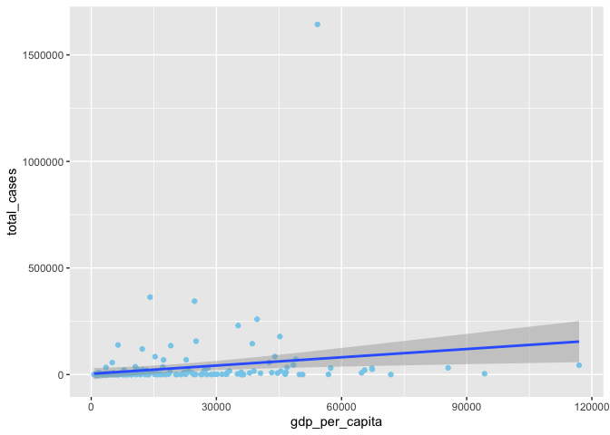
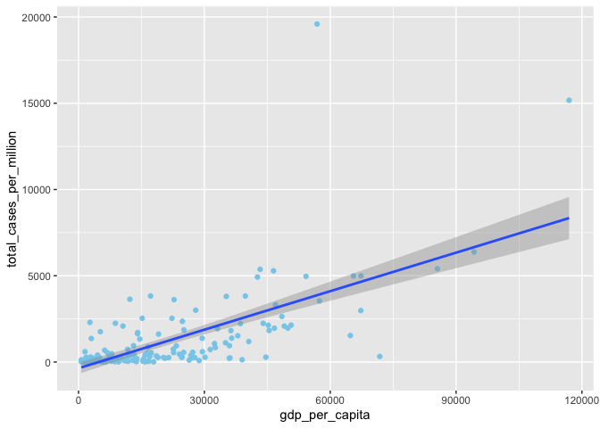
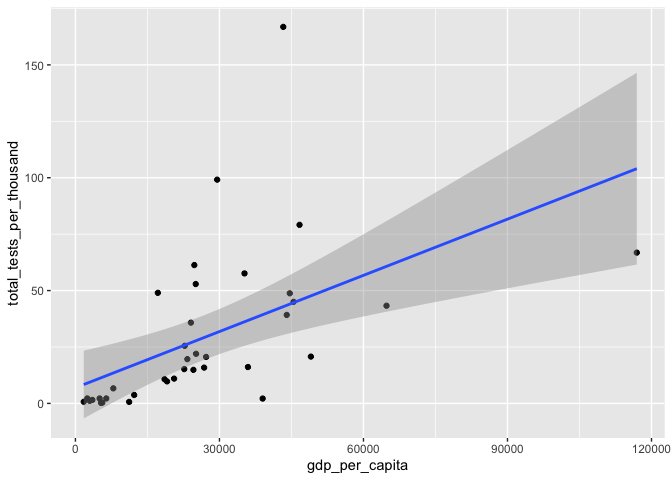
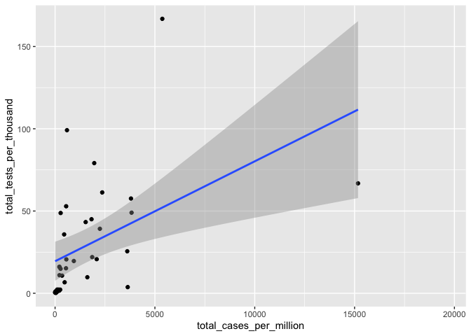
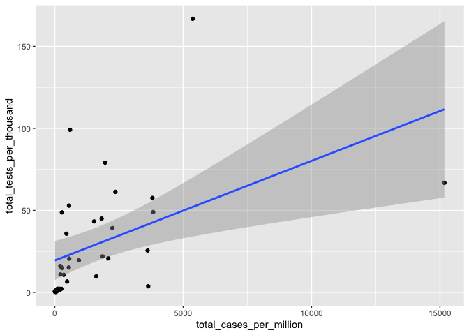
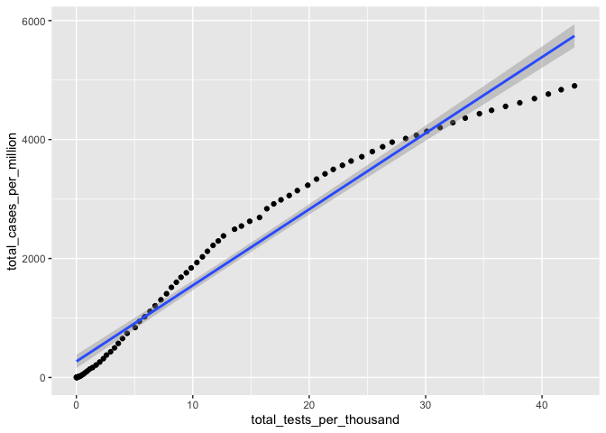
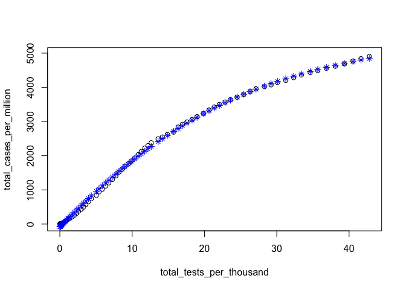
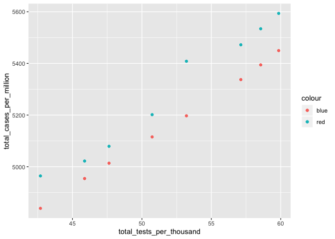

### Introduction

I am starting out with a very simple question: Are rich countries or
poor countries affected more by the coronavirus? I am using GDP as an
indicator of “richness” even though this may or may not be the most
accurate representation possible.

    # packages and data is read in
    library(dplyr)

    ## 
    ## Attaching package: 'dplyr'

    ## The following objects are masked from 'package:stats':
    ## 
    ##     filter, lag

    ## The following objects are masked from 'package:base':
    ## 
    ##     intersect, setdiff, setequal, union

    library(ggplot2)
    corona = read.csv("~/Downloads/owid-covid-data.csv")
    recent = filter(corona,date=='2020-05-25')
    recent = filter(recent,location!='World')

### Exploration

Are GDP and total cases correlated?

    # is there a correlation between gdp per capita and total cases?
    ggplot(recent,aes(x=gdp_per_capita,y=total_cases))+
      geom_point(color="skyblue")+
      geom_smooth(method='lm')

    ## Warning: Removed 28 rows containing non-finite values (stat_smooth).

    ## Warning: Removed 28 rows containing missing values (geom_point).

    x = lm(gdp_per_capita ~ total_cases,recent)
    summary(x)

    ## 
    ## Call:
    ## lm(formula = gdp_per_capita ~ total_cases, data = recent)
    ## 
    ## Residuals:
    ##    Min     1Q Median     3Q    Max 
    ## -17784 -14645  -6623   8335  97239 
    ## 
    ## Coefficients:
    ##              Estimate Std. Error t value Pr(>|t|)    
    ## (Intercept) 1.843e+04  1.482e+03  12.434  < 2e-16 ***
    ## total_cases 2.901e-02  1.102e-02   2.632  0.00923 ** 
    ## ---
    ## Signif. codes:  0 '***' 0.001 '**' 0.01 '*' 0.05 '.' 0.1 ' ' 1
    ## 
    ## Residual standard error: 19430 on 178 degrees of freedom
    ##   (28 observations deleted due to missingness)
    ## Multiple R-squared:  0.03746,    Adjusted R-squared:  0.03205 
    ## F-statistic: 6.927 on 1 and 178 DF,  p-value: 0.009234

    #seems to be a slightly positive correlation

This didn’t really yield any conclusive results. However, what if we
compared the GDP per capita with the number of cases per million? If we
compare both on a scale of per person, we should get more reliable
results!

    ggplot(recent,aes(x=gdp_per_capita,y=total_cases_per_million))+
      geom_point(color="skyblue")+
      geom_smooth(method='lm')

    ## Warning: Removed 28 rows containing non-finite values (stat_smooth).

    ## Warning: Removed 28 rows containing missing values (geom_point).

    x = lm(gdp_per_capita ~ total_cases_per_million,recent)
    summary(x)

    ## 
    ## Call:
    ## lm(formula = gdp_per_capita ~ total_cases_per_million, data = recent)
    ## 
    ## Residuals:
    ##    Min     1Q Median     3Q    Max 
    ## -73275 -10275  -3377   8565  57051 
    ## 
    ## Coefficients:
    ##                          Estimate Std. Error t value Pr(>|t|)    
    ## (Intercept)             1.283e+04  1.224e+03   10.48   <2e-16 ***
    ## total_cases_per_million 5.987e+00  5.005e-01   11.96   <2e-16 ***
    ## ---
    ## Signif. codes:  0 '***' 0.001 '**' 0.01 '*' 0.05 '.' 0.1 ' ' 1
    ## 
    ## Residual standard error: 14750 on 178 degrees of freedom
    ##   (28 observations deleted due to missingness)
    ## Multiple R-squared:  0.4456, Adjusted R-squared:  0.4425 
    ## F-statistic:   143 on 1 and 178 DF,  p-value: < 2.2e-16

From this it would seem that higher GDP indicates more cases? That
doesn’t seem right! I think one confounding factor might be testing.

    ggplot(recent,aes(x=gdp_per_capita,y=total_tests_per_thousand))+
      geom_point()+
      geom_smooth(method='lm')

    ## Warning: Removed 171 rows containing non-finite values (stat_smooth).

    ## Warning: Removed 171 rows containing missing values (geom_point).

    summary(lm(gdp_per_capita~total_tests_per_thousand,recent))

    ## 
    ## Call:
    ## lm(formula = gdp_per_capita ~ total_tests_per_thousand, data = recent)
    ## 
    ## Residuals:
    ##    Min     1Q Median     3Q    Max 
    ## -29697 -11489  -1805   3521  77663 
    ## 
    ## Coefficients:
    ##                          Estimate Std. Error t value Pr(>|t|)    
    ## (Intercept)               16752.7     4074.1   4.112 0.000226 ***
    ## total_tests_per_thousand    337.1       91.4   3.688 0.000762 ***
    ## ---
    ## Signif. codes:  0 '***' 0.001 '**' 0.01 '*' 0.05 '.' 0.1 ' ' 1
    ## 
    ## Residual standard error: 18850 on 35 degrees of freedom
    ##   (171 observations deleted due to missingness)
    ## Multiple R-squared:  0.2798, Adjusted R-squared:  0.2592 
    ## F-statistic:  13.6 on 1 and 35 DF,  p-value: 0.0007625

    ggplot(recent,aes(x=total_cases_per_million,y=total_tests_per_thousand))+
      geom_point()+
      geom_smooth(method='lm')

    ## Warning: Removed 171 rows containing non-finite values (stat_smooth).

    ## Warning: Removed 171 rows containing missing values (geom_point).

    summary(lm(total_cases_per_million~total_tests_per_thousand,recent))

    ## 
    ## Call:
    ## lm(formula = total_cases_per_million ~ total_tests_per_thousand, 
    ##     data = recent)
    ## 
    ## Residuals:
    ##     Min      1Q  Median      3Q     Max 
    ## -3552.8  -686.7  -460.1  -256.4 12217.1 
    ## 
    ## Coefficients:
    ##                          Estimate Std. Error t value Pr(>|t|)   
    ## (Intercept)                489.90     517.29   0.947  0.35011   
    ## total_tests_per_thousand    36.91      11.61   3.180  0.00308 **
    ## ---
    ## Signif. codes:  0 '***' 0.001 '**' 0.01 '*' 0.05 '.' 0.1 ' ' 1
    ## 
    ## Residual standard error: 2393 on 35 degrees of freedom
    ##   (171 observations deleted due to missingness)
    ## Multiple R-squared:  0.2242, Adjusted R-squared:  0.202 
    ## F-statistic: 10.11 on 1 and 35 DF,  p-value: 0.003077

Since there is high correlation between gdp and cases, it seems likely
that the data doesn’t tell the full story.

### Hypothesis test

    ## A hypothesis test:
    ## Are no. of tests per thousand and no. of cases per million independent
    ## Let's do a chi squared test
    ### but first
    frame2 = filter(recent,!(is.na(total_tests_per_thousand)))
    ggplot(frame2,aes(x=total_cases_per_million,y=total_tests_per_thousand))+
      geom_point()+
      geom_smooth(method='lm')

    summary(lm(total_cases_per_million~total_tests_per_thousand,frame2))

    ## 
    ## Call:
    ## lm(formula = total_cases_per_million ~ total_tests_per_thousand, 
    ##     data = frame2)
    ## 
    ## Residuals:
    ##     Min      1Q  Median      3Q     Max 
    ## -3552.8  -686.7  -460.1  -256.4 12217.1 
    ## 
    ## Coefficients:
    ##                          Estimate Std. Error t value Pr(>|t|)   
    ## (Intercept)                489.90     517.29   0.947  0.35011   
    ## total_tests_per_thousand    36.91      11.61   3.180  0.00308 **
    ## ---
    ## Signif. codes:  0 '***' 0.001 '**' 0.01 '*' 0.05 '.' 0.1 ' ' 1
    ## 
    ## Residual standard error: 2393 on 35 degrees of freedom
    ## Multiple R-squared:  0.2242, Adjusted R-squared:  0.202 
    ## F-statistic: 10.11 on 1 and 35 DF,  p-value: 0.003077

    ###
    avg_tests = mean(frame2$total_tests_per_thousand)
    avg_cases = mean(frame2$total_cases_per_million)
    above_avg_test = filter(frame2,total_tests_per_thousand>avg_tests)
    below_avg_test = filter(frame2,total_tests_per_thousand<avg_tests)
    aa = length(filter(above_avg_test,total_cases_per_million>avg_cases)$iso_code)
    ab = length(filter(above_avg_test,total_cases_per_million<avg_cases)$iso_code)
    ba = length(filter(below_avg_test,total_cases_per_million>avg_cases)$iso_code)
    bb = length(filter(below_avg_test,total_cases_per_million<avg_cases)$iso_code)
    actual = c(aa,ab,ba,bb)
    evaa = (aa+ab)*(aa+ba)/(aa+ab+ba+bb)
    evab = (aa+ab)*(ab+bb)/(aa+ab+ba+bb)
    evba = (ba+bb)*(ba+aa)/(aa+ab+ba+bb)
    evbb = (bb+ab)*(bb+ba)/(aa+ab+ba+bb)
    exp = c(evaa,evab,evba,evbb)
    chisqr = sum(((actual-exp)^2)/exp)
    pval = (1-pchisq(chisqr,df=1))*100
    pval

    ## [1] 1.32865

Since the p value is 1.32% We can see that these are clearly dependent
\#\#\# Some Linear Modelling

    ## okay so now linear modelling
    ### training
    usa_data = filter(corona,iso_code=="USA")
    usa_data$dayno = 1:147
    ggplot(usa_data,aes(x=total_tests_per_thousand,y=total_cases_per_million))+
      geom_point()+
      geom_smooth(method='lm')

    ## Warning: Removed 68 rows containing non-finite values (stat_smooth).

    ## Warning: Removed 68 rows containing missing values (geom_point).

    plot(total_cases_per_million~total_tests_per_thousand,usa_data)
    fit1 = lm(total_cases_per_million~total_tests_per_thousand+I(total_tests_per_thousand^2)+I(total_tests_per_thousand^4),usa_data)
    fit1

    ## 
    ## Call:
    ## lm(formula = total_cases_per_million ~ total_tests_per_thousand + 
    ##     I(total_tests_per_thousand^2) + I(total_tests_per_thousand^4), 
    ##     data = usa_data)
    ## 
    ## Coefficients:
    ##                   (Intercept)       total_tests_per_thousand  
    ##                    -8.567e+01                      2.216e+02  
    ## I(total_tests_per_thousand^2)  I(total_tests_per_thousand^4)  
    ##                    -2.833e+00                      1.885e-04

    summary(fit1)

    ## 
    ## Call:
    ## lm(formula = total_cases_per_million ~ total_tests_per_thousand + 
    ##     I(total_tests_per_thousand^2) + I(total_tests_per_thousand^4), 
    ##     data = usa_data)
    ## 
    ## Residuals:
    ##      Min       1Q   Median       3Q      Max 
    ## -121.700  -35.547    5.216   42.360  112.368 
    ## 
    ## Coefficients:
    ##                                 Estimate Std. Error t value Pr(>|t|)    
    ## (Intercept)                   -8.567e+01  1.320e+01  -6.493 8.16e-09 ***
    ## total_tests_per_thousand       2.216e+02  3.222e+00  68.793  < 2e-16 ***
    ## I(total_tests_per_thousand^2) -2.833e+00  1.519e-01 -18.653  < 2e-16 ***
    ## I(total_tests_per_thousand^4)  1.885e-04  5.366e-05   3.513 0.000755 ***
    ## ---
    ## Signif. codes:  0 '***' 0.001 '**' 0.01 '*' 0.05 '.' 0.1 ' ' 1
    ## 
    ## Residual standard error: 60.86 on 75 degrees of freedom
    ##   (68 observations deleted due to missingness)
    ## Multiple R-squared:  0.9987, Adjusted R-squared:  0.9987 
    ## F-statistic: 1.975e+04 on 3 and 75 DF,  p-value: < 2.2e-16

    plot(total_cases_per_million~total_tests_per_thousand,usa_data)
    x = usa_data$total_tests_per_thousand
    points(x[!is.na(x)],fitted(fit1),col='blue',pch=8)

    ### model has been created

    ## now to see if it predicts well

    ## Inputting new data

    corona_updated = read.csv("~/Downloads/owid-covid-data-updated.csv")
    usa_new = filter(corona_updated,iso_code=="USA")
    usa_new$dayno = 1:length(usa_new$total_cases_per_million)
    ##predict(fit1)
    test_data = filter(usa_new,(dayno<158 & dayno>146))
    prediction_data = predict(fit1,data.frame(total_tests_per_thousand=test_data$total_tests_per_thousand),interval="confidence")
    predicted_values = prediction_data[1:11]
    test_data$predicted_values = predicted_values
    ggplot(test_data)+
      geom_point(aes(x=total_tests_per_thousand,y=total_cases_per_million,col='red'))+
      geom_point(aes(x=total_tests_per_thousand,y=predicted_values,col='blue'))

    ## Warning: Removed 3 rows containing missing values (geom_point).

    ## Warning: Removed 3 rows containing missing values (geom_point).

